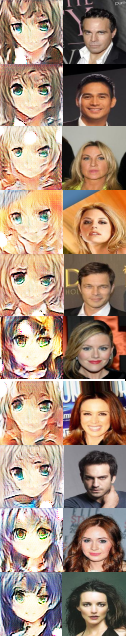
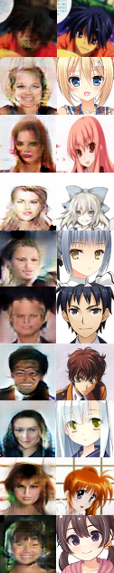

# Anime CycleGAN #
## Implementation ##
I decided to use Keras with Tensorflow as backend. I implemented the CycleGAN using the same indications provided by the author. I did not use in this iteration the data pool suggested by the author and replaced the mean squared error by crossentropy los (original GAN formulation).
I used a patch based discriminator with 8x8 window, using self-attention for every pooling step. I used the resnet generator with attention at every pooling step and after the bottleneck.

## Results ##
Source image is the right one, tranlated on the left.

## Discussion ##
I really think I achieved a really good result on this first try. The generator is using the info provided by the source image providing a really good translation. Nevertheless, there is a bit of mode collapse on the anime -> human generator.

## Future Work ##

- [] Try Spectral normalization.
- [] Try BatchNorm/InstanceNorm.
- [] Find optimal LR.
- [] Try different regularizators on the generator loss.
- [] Try a Discriminator Ensemble.
